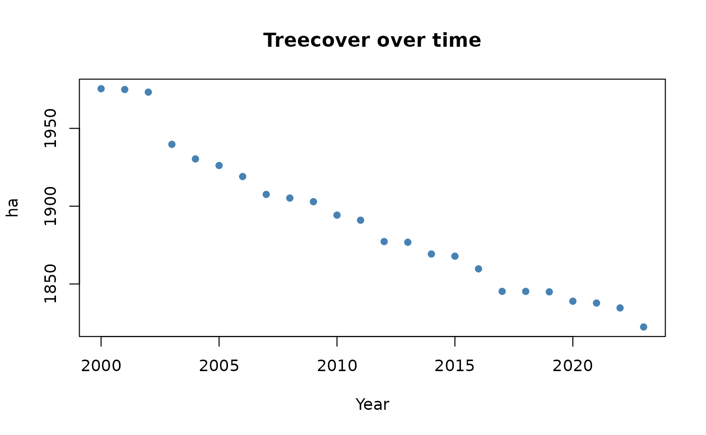

# Quickstart

## Introduction

In the following we will demonstrate an idealized workflow based on a
subset of the Global Forest Watch (GFW) data set that is delivered
together with this package. You can follow along the code snippets below
to reproduce the results. Please note that to reduce the time it takes
to process this vignette, we will not download any resources from the
internet. In a real use case, thus processing time might substantially
increase because resources have to be downloaded and real portfolios
might be larger than the one created in this example.

This vignette assumes that you have already followed the steps in
[Installation](https://mapme-initiative.github.io/mapme.biodiversity/articles/installation.html)
and have familiarized yourself with the terminology used in the package.
If you are unfamiliar with the terminology used here, please head over
to the
[Terminology](https://mapme-initiative.github.io/mapme.biodiversity/articles/terminology.html)
article to learn about the most important concepts.

The idealized workflow for using
[mapme.biodiversity](https://mapme-initiative.github.io/mapme.biodiversity/)
consists of the following steps:

- prepare your sf-object containing only geometries of type `'POLYGON'`
  or `'MULTIPOLYGON'`
- decide which indicator(s) you wish to calculate and make the required
  resource(s) available
- conduct your indicator calculation, which adds a nested list column to
  your portfolio object
- continue your analysis in R or decide to export your results to a
  spatial data format to use it with other geospatial software

## Getting started

First, we will load the
[mapme.biodiversity](https://mapme-initiative.github.io/mapme.biodiversity/)
and the [sf](https://r-spatial.github.io/sf/) package for handling
spatial vector data. For tabular data handling, we will also load the
[dplyr](https://dplyr.tidyverse.org) and
[tidyr](https://tidyr.tidyverse.org) packages. Then, we will read an
internal GeoPackage which includes part of the geometry of a protected
area in the Dominican Republic from the WDPA database.

``` r

library(mapme.biodiversity)
library(sf)
library(dplyr)
library(tidyr)

aoi_path <- system.file("extdata", "gfw_sample.gpkg", package = "mapme.biodiversity")
aoi <- st_read(aoi_path, quiet = TRUE)
aoi
#> Simple feature collection with 1 feature and 0 fields
#> Geometry type: POLYGON
#> Dimension:     XY
#> Bounding box:  xmin: -71.73773 ymin: 18.63179 xmax: -71.69 ymax: 18.68691
#> Geodetic CRS:  WGS 84
#>                             geom
#> 1 POLYGON ((-71.73417 18.6435...
```

## Setting standard option

We use the
[`mapme_options()`](https://mapme-initiative.github.io/mapme.biodiversity/reference/mapme.md)
function and set some arguments, such as the output directory, that are
important to govern the subsequent processing. For this, we create a
temporary directory. Internally, to save time on downloading when
building this vignette, we copied already existing files to that output
location (code not shown here).

``` r

outdir <- file.path(tempdir(), "mapme-resources")
dir.create(outdir, showWarnings = FALSE)

mapme_options(
  outdir = outdir,
  verbose = TRUE
)
```

The `outdir` argument points towards a directory on the local file
system of your machine. All downloaded resources will be written to
respective directories nested within `outdir`.

Once you request a specific resource for your portfolio, only those
files will be downloaded that are missing to match its spatio-temporal
extent. This behaviour is beneficial, e.g. in case you share the
`outdir` between different projects to ensure that only resources
matching your current portfolio are returned.

The `verbose` logical controls whether or not the package will print
informative messages during the calculations. Note, that even if set to
`FALSE`, the package will inform users about any potential errors or
warnings.

## Getting the right resources

You can check which indicators are available via the
[`available_indicators()`](https://mapme-initiative.github.io/mapme.biodiversity/reference/indicators.md)
function:

``` r

available_indicators()
#> # A tibble: 40 × 3
#>    name                          description                           resources
#>    <chr>                         <chr>                                 <list>   
#>  1 biodiversity_intactness_index Averaged biodiversity intactness ind… <tibble> 
#>  2 biome                         Areal statistics of biomes from TEOW  <tibble> 
#>  3 burned_area                   Monthly burned area detected by MODI… <tibble> 
#>  4 deforestation_drivers         Areal statistics of deforestation dr… <tibble> 
#>  5 drought_indicator             Relative wetness statistics based on… <tibble> 
#>  6 ecoregion                     Areal statistics of ecoregions based… <tibble> 
#>  7 elevation                     Statistics of elevation based on NAS… <tibble> 
#>  8 exposed_population_acled      Number of people exposed to conflict… <tibble> 
#>  9 exposed_population_ucdp       Number of people exposed to conflict… <tibble> 
#> 10 fatalities_acled              Number of fatalities by event type b… <tibble> 
#> # ℹ 30 more rows
available_indicators("treecover_area")
#> # A tibble: 1 × 3
#>   name           description                  resources       
#>   <chr>          <chr>                        <list>          
#> 1 treecover_area Area of forest cover by year <tibble [2 × 5]>
```

Say, we are interested in the `treecover_area` indicator. We can learn
more about this indicator and its required resources by using either of
the commands below or, if you are viewing the online version, head over
to the
[treecover_area](https://mapme-initiative.github.io/mapme.biodiversity/reference/treecover_area.html)
documentation.

``` r

?treecover_area
help(treecover_area)
```

By inspecting the help page we learned that this indicator requires the
`gfw_treecover` and `gfw_lossyear` resources and it requires to specify
three extra arguments: the years for which to calculate treecover, the
minimum size of patches to be considered as forest and the minimum
canopy coverage of a single pixel to be considered as forested.

With that information at hand, we can start to retrieve the required
resource. We can learn about all available resources using the
[`available_resources()`](https://mapme-initiative.github.io/mapme.biodiversity/reference/resources.md)
function:

``` r

available_resources()
#> # A tibble: 35 × 5
#>    name                          description                licence source type 
#>    <chr>                         <chr>                      <chr>   <chr>  <chr>
#>  1 accessibility_2000            Accessibility data for th… See JR… https… rast…
#>  2 acled                         Armed Conflict Location &… Visit … Visit… vect…
#>  3 biodiversity_intactness_index Biodiversity Intactness I… CC-BY-… https… rast…
#>  4 chelsa                        Climatologies at High res… Unknow… https… rast…
#>  5 chirps                        Climate Hazards Group Inf… CC - u… https… rast…
#>  6 esalandcover                  Copernicus Land Monitorin… CC-BY … https… rast…
#>  7 fritz_et_al                   Drivers of deforestation … CC-BY … https… rast…
#>  8 gfw_emissions                 Global Forest Watch - CO2… CC-BY … https… rast…
#>  9 gfw_lossyear                  Global Forest Watch - Yea… CC-BY … https… rast…
#> 10 gfw_treecover                 Global Forest Watch - Per… CC-BY … https… rast…
#> # ℹ 25 more rows
available_resources("gfw_treecover")
#> # A tibble: 1 × 5
#>   name          description                                 licence source type 
#>   <chr>         <chr>                                       <chr>   <chr>  <chr>
#> 1 gfw_treecover Global Forest Watch - Percentage of canopy… CC-BY … https… rast…
```

For the purpose of this vignette, we are going to download both, the
`gfw_treecover` and `gfw_lossyear` resources. We can get more detailed
information about a given resource, by using either of the commands
below to open up the help page. If you are viewing the online version of
this documentation, you can simply head over to the
[gfw_treecover](https://mapme-initiative.github.io/mapme.biodiversity/reference/gfw_treecover.html)
resource documentation.

``` r

?gfw_treecover
help(gfw_treecover)
?gfw_lossyear
help(gfw_lossyear)
```

We can now make the required resources available for our portfolio. We
will use a common interface that is used for all resources, called
[`get_resources()`](https://mapme-initiative.github.io/mapme.biodiversity/reference/mapme.md).
We have to specify our portfolio object and supply one or more resource
functions with their respective arguments. This will then download the
matching resources to the output directory specified earlier.

``` r

aoi <- get_resources(
  x = aoi,
  get_gfw_treecover(version = "GFC-2023-v1.11"),
  get_gfw_lossyear(version = "GFC-2023-v1.11")
)
```

## Calculate specific indicators

The next step consists of calculating specific indicators. Note that
each indicator requires one or more resources that were made available
via the
[`get_resources()`](https://mapme-initiative.github.io/mapme.biodiversity/reference/mapme.md)
function explained above. You will have to re-run this function in every
new R session, but note that data that is already available will not be
re-downloaded.

Here, we are going to calculate the `treecover_area` indicator which is
based on the resources from GFW. Since the resources have been made
available in the previous step, we can continue requesting the
calculation of our desired indicator. Note the command below would issue
an error in case a required resource has not been made available via
[`get_resources()`](https://mapme-initiative.github.io/mapme.biodiversity/reference/mapme.md)
beforehand.

``` r

aoi <- calc_indicators(
  aoi,
  calc_treecover_area(years = 2000:2023, min_size = 1, min_cover = 30)
)
```

Now let’s take a look at the results. In addition to the metadata we are
already familiar with, we see that there is an additional column called
`treecover_area` which contains a `tibble`.

``` r

aoi
#> Simple feature collection with 1 feature and 2 fields
#> Geometry type: POLYGON
#> Dimension:     XY
#> Bounding box:  xmin: -71.73773 ymin: 18.63179 xmax: -71.69 ymax: 18.68691
#> Geodetic CRS:  WGS 84
#> # A tibble: 1 × 3
#>   assetid treecover_area                                                    geom
#>     <int> <list>                                                   <POLYGON [°]>
#> 1       1 <tibble [24 × 4]> ((-71.73735 18.64734, -71.71386 18.63179, -71.69 18…
```

The indicator is represented as a nested-list column in our `sf`-object
that is named alike the requested indicator. For our single asset, this
column contains a tibble with 24 rows and four columns. Let’s have a
closer look at this object

``` r

aoi$treecover_area
#> [[1]]
#> # A tibble: 24 × 4
#>    datetime            variable  unit  value
#>    <dttm>              <chr>     <chr> <dbl>
#>  1 2000-01-01 00:00:00 treecover ha    1976.
#>  2 2001-01-01 00:00:00 treecover ha    1976.
#>  3 2002-01-01 00:00:00 treecover ha    1974.
#>  4 2003-01-01 00:00:00 treecover ha    1941.
#>  5 2004-01-01 00:00:00 treecover ha    1931.
#>  6 2005-01-01 00:00:00 treecover ha    1927.
#>  7 2006-01-01 00:00:00 treecover ha    1920.
#>  8 2007-01-01 00:00:00 treecover ha    1909.
#>  9 2008-01-01 00:00:00 treecover ha    1906.
#> 10 2009-01-01 00:00:00 treecover ha    1904.
#> # ℹ 14 more rows
```

The tibble follows a standard output format, which is the same for all
indicators. Each indicator is represented as a tibble with the four
columns `datetime`, `variable`, `unit`, and `value`. In case of the
`treecover_area` indicator, the variable is called `treecover` and is
expressed in `ha`.

Let’s quickly visualize the results:



If you wish to change the layout of an portfolio, you can use
[`portfolio_long()`](https://mapme-initiative.github.io/mapme.biodiversity/reference/portfolio.md)
and
[`portfolio_wide()`](https://mapme-initiative.github.io/mapme.biodiversity/reference/portfolio.md)
(see the respective [online
tutorial](https://mapme-initiative.github.io/mapme.biodiversity/articles/output-wide.html)).
Especially for large portfolios, it is usually a good idea to keep the
geometry information in a separated variable to keep the size of the
data object relatively small.

``` r

geoms <- st_geometry(aoi)
portfolio_long(aoi, drop_geoms = TRUE)
#> # A tibble: 24 × 6
#>    assetid indicator      datetime            variable  unit  value
#>      <int> <chr>          <dttm>              <chr>     <chr> <dbl>
#>  1       1 treecover_area 2000-01-01 00:00:00 treecover ha    1976.
#>  2       1 treecover_area 2001-01-01 00:00:00 treecover ha    1976.
#>  3       1 treecover_area 2002-01-01 00:00:00 treecover ha    1974.
#>  4       1 treecover_area 2003-01-01 00:00:00 treecover ha    1941.
#>  5       1 treecover_area 2004-01-01 00:00:00 treecover ha    1931.
#>  6       1 treecover_area 2005-01-01 00:00:00 treecover ha    1927.
#>  7       1 treecover_area 2006-01-01 00:00:00 treecover ha    1920.
#>  8       1 treecover_area 2007-01-01 00:00:00 treecover ha    1909.
#>  9       1 treecover_area 2008-01-01 00:00:00 treecover ha    1906.
#> 10       1 treecover_area 2009-01-01 00:00:00 treecover ha    1904.
#> # ℹ 14 more rows
```

### A note on parallel computing

[mapme.biodiversity](https://mapme-initiative.github.io/mapme.biodiversity/)
follows the parallel computing paradigm of the
[`{future}`](https://cran.r-project.org/package=future) package. That
means that you as a user are in the control if and how you would like to
set up parallel processing. Since `{mapme.biodiversity} v0.9`, we apply
pre-chunking to all assets in the portfolio. That means that assets are
split up into components of roughly the size of `chunk_size`. These
components can than be iterated over in parallel to speed up processing.
Indicator values will be aggregated automatically.

``` r

library(future)
plan(cluster, workers = 6)
```

As another example, with the code below one would apply parallel
processing of 2 assets, with each having 4 workers available to process
chunks, thus requiring a total of 8 available cores on the host machine.
Be sure to not request more workers than available on your machine.

``` r

library(progressr)

plan(cluster, workers = 2)

with_progress({
  aoi <- calc_indicators(
    aoi,
    calc_treecover_area_and_emissions(
      min_size = 1,
      min_cover = 30
    )
  )
})

plan(sequential) # close child processes
```

## Exporting an portfolio object

You can use the
[`write_portfolio()`](https://mapme-initiative.github.io/mapme.biodiversity/reference/portfolio.md)
function to save a processed portfolio object to disk as a `GeoPackage`.
This allows sharing your data with contributors who might not be using
R, but any other geospatial software. Simply point towards a
non-existing file on your local disk to write the portfolio. You can use
[`read_portfolio()`](https://mapme-initiative.github.io/mapme.biodiversity/reference/portfolio.md)
to read back a GeoPackage written in such a way into R:

``` r

dsn <- tempfile(fileext = ".gpkg")
write_portfolio(x = aoi, dsn = dsn, quiet = TRUE)
from_disk <- read_portfolio(dsn, quiet = TRUE)
from_disk
#> Simple feature collection with 1 feature and 2 fields
#> Geometry type: POLYGON
#> Dimension:     XY
#> Bounding box:  xmin: -71.73773 ymin: 18.63179 xmax: -71.69 ymax: 18.68691
#> Geodetic CRS:  WGS 84
#> # A tibble: 1 × 3
#>   assetid treecover_area                                                    geom
#>     <int> <list>                                                   <POLYGON [°]>
#> 1       1 <tibble [24 × 4]> ((-71.73735 18.64734, -71.71386 18.63179, -71.69 18…
```

    #> [1] TRUE
