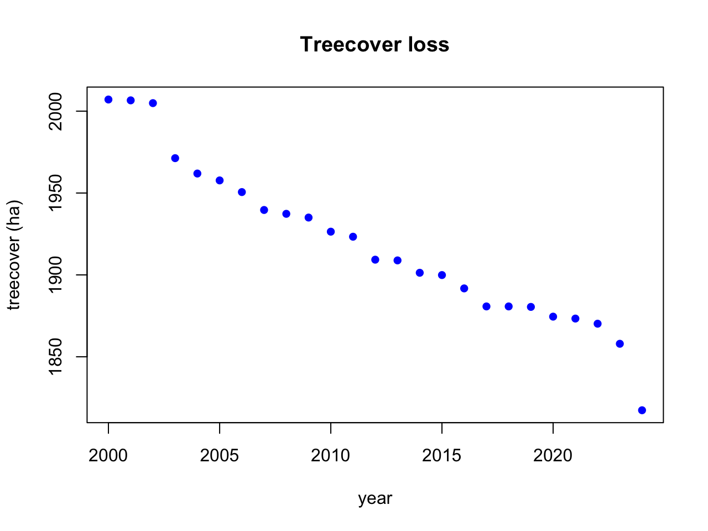

# Summary

The \texttt{mapme.biodiversity} \texttt{R} package provides access to
data and analyisis routines to several datasets relevant to conservation
research. It can be used by scientists and practitioners to analyse
conservation portfolios in a consistent way. The software integrates
well into existing workflows and spatial analyses using the \texttt{R}
programming environment. It has been used in impact evaluations to
assess the effectivness of international donor interventions to reduce
forest cover loss.

# Statement of need

To prevent biodiversity losses at scale, conservation researchers
require area-based indicators that monitor the state of portfolios of
intervention areas over time. However, relevant spatial data resources
are scattered across data repositories and servers for which access
patterns can differ significantly. Most other software usually focuses
on the analysis of a single (group of) data resource, increasing the
cognitive burden on researchers who have to learn multiple interfaces
and put substantial efforts into harmonizing output structures.

The \texttt{mapme.biodiversity} \texttt{R} package provides a single
access pattern to a diverse set of conservation related data resources
from diverse sources. It provides a common interface to derive
area-based indicators for conservation portfolios in a standardized
output format. Further workflows and analysis of the indicators can be
conducted in the \texttt{R} computing environment or with other tools of
one's liking through the serialization of data to standard spatial
formats. It thus helps individuals and groups active in conservation
research to streamline their spatial data acqusition process.

# Main Features

-   **Data Acquisition & Preparation**: Provides seamless access to a
    broad range of biodiversity-related global datasets, with automated
    downloading and preprocessing based on temporal and spatial
    filtering for user-defined AOIs, along with efficient data caching
    (local storage of preprocessed datasets to prevent redundant
    downloads).

-   **Spatial Analysis, Aggregation, and Summarization**: Offers a
    harmonized set of tools for calculating numerous biodiversity
    indicators, with results that can be aggregated at user-defined
    spatial scales.

-   **Scalability**: Utilizes existing R packages for spatial data
    handling (`terra`, `sf`), data manipulation (`dplyr`), and parallel
    processing (`future`) to efficiently handle large datasets. Supports
    multiple AOIs as input (vector-centric design), enabling the
    processing of many regions of interest in a single run.

-   **Reproducibility**: Features a modular, scriptable workflow that
    makes analyses easy to reproduce and share.

-   **Customizability**: Provides an extensible framework that allows
    users to add datasets and create their own indicators to meet
    specific research or conservation needs.

-   **Output formats** (standard geospatial file formats) are compatible
    with a variety of tools for analysis and reporting, including other
    R packages and external GIS software.

# Applications

-   KfW: Impact evaluations (Melvin)

-   KfW: Reporting to Ministry (Johannes/Sven)

-   IRD: Research projects & capacity development (Florent)

-   WWF and others?

# Comparison with other software packages

-   JRC's DOPA: <https://www.preprints.org/manuscript/202408.1146/v1> &\
    <https://github.com/giacomo-gcad/dopa_workflow/>
-   wdpar: <https://github.com/prioritizr/wdpar>
-   Red List Indices:
    <https://github.com/red-list-ecosystem/rle_indices>
-   GFW API: <https://data-api.globalforestwatch.org/>
-   Others?

# Minimal code example

This is what a minimalistic workflow might look like:

```         
library(mapme.biodiversity)
# define AOI
aoi_path <- system.file("extdata", "gfw_sample.gpkg", package = "mapme.biodiversity")
aoi <- sf::read_sf(aoi_path)
# get the resource data
res <- get_resources(aoi,
                     get_gfw_treecover(version = "GFC-2024-v1.12"),
                     get_gfw_lossyear(version = "GFC-2024-v1.12"))
# compute the indicator
ind <- calc_indicators(res,
                       calc_treecover_area(years = 2000:2024, 
                       min_size = 1, min_cover = 30))
# transform into a more suitable format
out <- portfolio_long(ind)
# plot the results
plot(out$datetime, out$value, col =  "blue", pch = 16, xlab = "year",
     ylab = sprintf("%s (%s)", out$variable[1], out$unit[1]), main =  "Treecover loss")
```



It demonstrates that one can perform the entire analysis – including
retrieving data, computing the indicator summary for the region of
interest, and plotting the results - with just a few lines of code.

The detailed documentation for the package can be found online
(<https://mapme-initiative.github.io/mapme.biodiversity/>).

More examples can be found in the online tutorial
(<https://mapme-initiative.github.io/demo-madeira/>).

# Availability

The \texttt{mapme.biodiversity} \texttt{R} package is implemented as an
extension package to the \texttt{R} statistical computing environment
[@rcore]. It is available on the Comprehensive R Archive Network (CRAN)
[@mapme]. Development versions are available on an online code
repository (<https://github.com/mapme-initiative/mapme.biodiversity>).
Documentation for the package can be found online
(<https://mapme-initiative.github.io/mapme.biodiversity/>).

# Acknowledgments

Author Darius A. Görgen was funded by the generous support of the
Kreditanstalt für Wiederaufbau (KfW).

# Conflict of interest

The authors declares no conflict of interest.

# References
