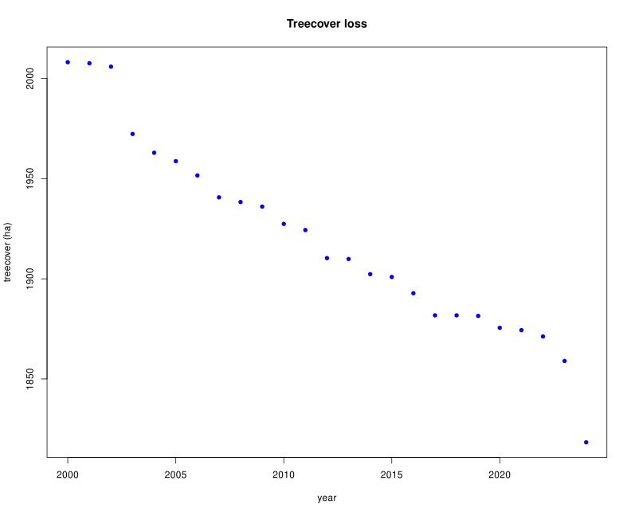

# Summary

The \texttt{mapme.biodiversity} \texttt{R} package provides an open and
reproducible framework for computing biodiversity-related indicators
from multiple global geospatial datasets. It streamlines access,
preprocessing, and analysis of spatial data to produce standardized,
area-based metrics that can be used for conservation monitoring, policy
evaluation, and research. By enabling reproducible, scalable, and extendable 
analyses across thematic datasets, \texttt{mapme.biodiversity} helps
to bridge the gap between raw geospatial information and decision-relevant
biodiversity indicators.

# Statement of need

To prevent biodiversity loss at scale, conservation researchers and
practitioners require area-based indicators derived from diverse spatial
datasets. However, relevant data sources are dispersed across multiple 
repositories and platforms, each with distinct access protocols, 
formats, and documentation standards.

Most existing tools focus on a specific data source or domain, offering
limited interoperability and requiring users to learn multiple
interfaces. This fragmentation imposes a high cognitive and technical
burden, especially on users who are not remote sensing specialists but
need spatial data for research, monitoring, or policy evaluation.

The \texttt{mapme.biodiversity} \texttt{R} package provides a unified
interface to access and process a wide range of spatial datasets
relevant to conservation and environmental management. It enables users
to derive standardized, area-based indicators at scale, supports
reproducible workflows in \texttt{R}, and facilitates integration with
other tools via export to standard spatial formats.

# State of the field

The Digital Observatory for Protected Areas provides a centralized, 
server-based system developed by the European Commission to compute global
protected-area indicators through standardized, automated workflows
[@juffe-bignoli_delivering_2024]. In contrast, \texttt{mapme.biodiversity} offers
an R-native, decentralized framework that enables users to reproduce
similar area-based analyses locally, adapt them to specific contexts,
and extend them with additional datasets.

The Global Forest Watch (\texttt{GFW}) API, developed by the World 
Resource Institute, provides access to selected global forest monitoring 
datasets such as tree cover, loss, gain, biomass, and fire activity 
derived from satellite products like Hansen et al. [-@hansen_high-resolution_2013]. 
It allows users to delegate computations to a remote cloud infrastructure and 
retrieve aggregated  statistics for defined areas. \texttt{mapme.biodiversity} 
instead performs all processing locally or on user-managed servers and is 
designed to handle a wider set of environmental and socio-economic data sources.

\texttt{BON in a Box}, developed by the Group on Earth Observations
Biodiversity Observation Network (GEO BON), is an open platform for
biodiversity monitoring and indicator computation[@griffith_bon_2024]. 
It enables users to assemble and share modular workflows that generate 
Essential Biodiversity Variables and policy-relevant indicators aligned 
with the Kunming–Montreal Global Biodiversity Framework. While \texttt{mapme.biodiversity} 
focuses on reproducible computation of area-based indicators within R, 
BON in a Box emphasizes cross-language interoperability and integration 
with national biodiversity monitoring systems.


# Research Impact Statement

The package is actively used by several institutions for both operational 
and research purposes. At the Kreditanstalt für Wiederaufbau (KfW) and 
the Agence Française de Développement -- the German and French public 
development banks for international development -- it is used for 
internal impact evaluations and reporting on funded conservation and 
development programs. At the French National Research Institute for 
Sustainable Development (IRD), the package is used in policy evaluation projects 
and in initiatives aimed at strengthening research capacity in the Global South, 
notably in Madagascar and Senegal. For instance, \texttt{mapme.biodiversity} is 
a central to the pre-analysis plans and ongoing empirical studies evaluating the 
impacts of protected areas on deforestation, including a registered study 
accepted at PLOS ONE [@ramiandrisoa2026]. The software has been incorporated into 
training materials used for capacity-building activities with government analysts 
and researchers, including workshops delivered to evaluation teams at the Ministry 
of Economy and Finance in Madagascar and to graduate students and early-career 
researchers at the University of Antananarivo (see online materials at 
[BETSAKA](https://betsaka.github.io/statcap_impact_training/)).


# Software design

Key features include:

-   **Data acquisition and preparation**: automated download and
    preprocessing of global geospatial datasets with spatial–temporal
    filtering for user-defined areas of interest, optional local or cloud-based caching 
    (e.g., through GDAL's virtual file system drivers, such as \texttt{/vsis3}).
-   **Indicator computation and aggregation**: harmonized routines for
    summarizing and aggregating results across spatial units.
-   **Scalability**: Utilizes existing R packages for spatial data
    handling (\texttt{terra}, \texttt{sf}), data manipulation
    (\texttt{dplyr}), and parallel processing (\texttt{future}) and
    progress monitoring (\texttt{progressr}) to handle large datasets.
    Supports multiple area of interest as input, enabling the
    processing of many regions of interest in a single run.
-   **Reproducibility**: supports standardized, modular, scriptable
    workflows to enable replication of analysis, auditing and sharing.
-   **Extensibility**: the framework allows users to add datasets add
    datasets and create their own indicators to meet specific research,
    monitoring or evaluation needs.
-   **Interoperability**: outputs in standard geospatial formats,
    compatible with external GIS and statistical software.

The following minimal example illustrates a typical workflow:

``` r
library(mapme.biodiversity)
# Define one or several areas of interest
aoi_path <- system.file("extdata", "gfw_sample.gpkg",
                        package = "mapme.biodiversity")
aoi <- sf::read_sf(aoi_path)
# Get the resource data
res <- get_resources(aoi,
                     get_gfw_treecover(version = "GFC-2024-v1.12"),
                     get_gfw_lossyear(version = "GFC-2024-v1.12"))
# Compute the indicator
ind <- calc_indicators(res,
                       calc_treecover_area(years = 2000:2024,
                                           min_size = 1, min_cover = 30))
# Save portfolio data to GeoPackage
write_portfolio(ind, "example.gpkg")
# Transform into long format for plotting
out <- portfolio_long(ind)
# plot the results
plot(out$datetime, out$value, col =  "blue", pch = 16, xlab = "year",
     ylab = sprintf("%s (%s)", out$variable[1], out$unit[1]),
     main =  "Treecover loss")
```

{#treecover width="60%"}

# Availability

The \texttt{mapme.biodiversity} \texttt{R} package is implemented as an
extension package to the \texttt{R} statistical computing environment
[@rcore]. It is available on the CRAN
[@mapme]. Development versions are available on an online code
[repository](https://github.com/mapme-initiative/mapme.biodiversity).
In addition to extensive online
[documentation](https://mapme-initiative.github.io/mapme.biodiversity)
that provides detailed information about the package,
\texttt{mapme.biodiversity} provides an applied
[workshop](https://github.com/mapme-initiative/demo-madeira)
using a real-world use-case scenario.

# AI usage disclosure

No generative AI tools were used in the development of this software, the writing
of this manuscript, or the preparation of supporting materials.

# Acknowledgments

The development and maintenance of the \texttt{mapme.biodiversity}
package have been funded by the KfW German Development Bank. The authors
thank all users and contributors who provided feedback and suggestions
that helped improve the package.

# Conflicts of interest

This software was developed through collaboration between KfW staff,
contracted developers, and independent researchers. DG, OB, ZK, and
AP contributed to the development under KfW funding; JS is employed
by KfW; and FB uses the package for research activities, some of
which are funded by the KfW. The authors declare that KfW support did
not hinder in any way the accuracy, reliability or performance of
this software, nor the objectivity with which it is presented in the
present article. All views expressed in this paper are those of the
authors and do not necessarily reflect those of KfW.

# References
